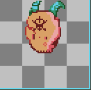

# Creacion de Sprites para Poryecto Final e Implementacion de Godot

Aseprite es una herramienta magnifica para la creacion de elementos en pixelart
con el cual la industria de los videojuegos INDIE rige bajo esta herramienta,es poderosa e intuitiva pero 
tambien hay mas opciones a aseprite, al mismo tiempo se esta implementando Godot, una alternativa de motor 
para unity el cual es mas ligero y permmite la misma calidad para crear videojuegos.

## Objetivo

Para esta iteracion del proyecto Final se planeo:
1. Crear variedad de Enemigos en aseprite.
2. implementar colores relacionados al espacio.
3. Instalar Godot para la respectiva funcionalidad de los sprites.

## Material creado

### 1. Enemigos

### 2. Objetos Escenario

## 3. Conclusion

Los presentes Sprites son los que estan siendo utilizados en
el proyecto final de nombre provisional Lunar Exile
el cual esta implementado en Godot Engine.